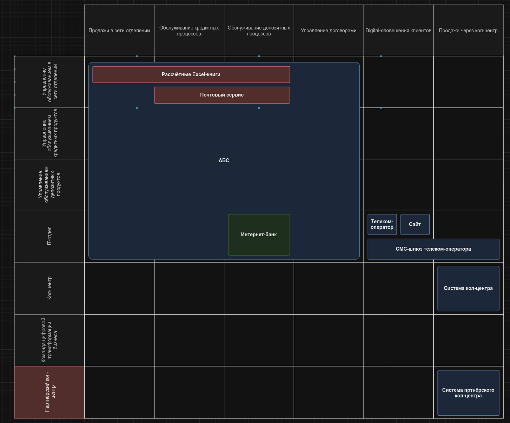

# Задание 1. Карта IT-ландшафта и схема интеграции приложений

### 1. Карта текущего IT-ландшафта

[it_landscape.drawio](./it_landscape.drawio)

### 2. Схема интеграции приложений

[system_integration.drawio](./system_integration.drawio)
